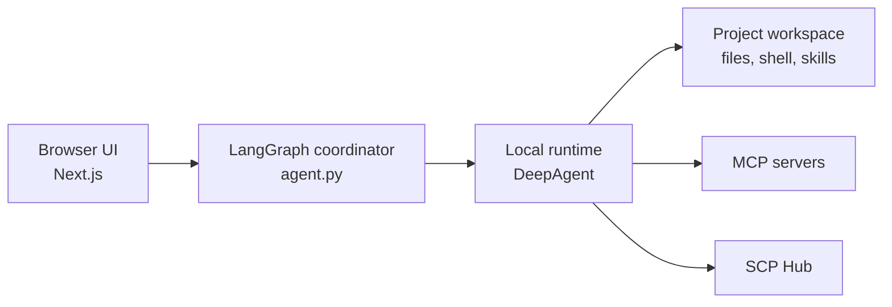

<div align="center">
  <p>
    
  </p>

  <h1 align="center">InternAgentS</h1>
  <p align="center">
    <strong>A local-first research agent workbench for scientific files, code, skills, and compute.</strong>
  </p>
  <p align="center">
    Built on DeepAgents and LangGraph, with project context, previews, tools, and human approvals in one browser UI.
  </p>
  <p align="center">
    <a href="https://github.com/qzzqzzb/OpenClaudeScience/stargazers"></a>
    
    
    
    
    
    
  </p>
  <p align="center">
    <strong>English</strong> | <a href="./README_CN.md">简体中文</a>
  </p>
  <p>
    <a href="#quick-start">Quick Start</a>
    · <a href="#example-workflows">Workflows</a>
    · <a href="#feature-highlights">Features</a>
    · <a href="#security-and-privacy">Security</a>
    · <a href="#architecture">Architecture</a>
    · <a href="#development">Development</a>
    · <a href="#license">License</a>
  </p>
</div>

InternAgentS gives researchers and developers a local browser workbench for
agentic research tasks. It combines a DeepAgents/LangGraph runtime, project
file preview, reusable skills, model configuration, local approvals, and
MCP/SCP connector setup in one UI.

The project is still early, but it is already useful as a local research
assistant shell: open a project, configure a model, browse files, start a
conversation, and add domain skills as your workflow grows.

## Quick Start

### Requirements

- Python 3.11+
- Node.js and npm. The UI uses `ui/package-lock.json` as the canonical lockfile.
- An OpenAI-compatible model endpoint, or the option to configure one later

### Start the Workbench

```bash
cp .env.example .env
./scripts/dev.sh
```

The launcher prepares the local environment and starts three services:

On first run, it creates `.venv`, installs the Python package in editable mode,
and runs `npm install --legacy-peer-deps --ignore-scripts` in `ui/`. Use
`INTERNAGENTS_SKIP_INSTALL=1` only after these dependencies are already present.

| Service | Default URL | Purpose |
| --- | --- | --- |
| UI | `http://127.0.0.1:3000` | Next.js workbench |
| Coordinator | `http://127.0.0.1:2024` | LangGraph API for the browser UI |
| Local runtime | `http://127.0.0.1:22024` | Project-scoped DeepAgent runtime |

Open:

```text
http://127.0.0.1:3000/?assistantId=agent_local
```

Logs are written to:

```text
.internagents/logs/backend.log
.internagents/logs/local-runtime.log
.internagents/logs/ui.log
```

Press `Ctrl+C` in the launcher terminal to stop the services started by the
script.

### Configure a Model

You can configure a model during first setup, or skip it and return later from
Settings. For an OpenAI-compatible endpoint:

```env
INTERNAGENTS_MODEL_PROVIDER=openai_compatible
OPENAI_BASE_URL=https://api.example.com/v1
OPENAI_API_KEY=sk-...
DEEPAGENT_MODEL=your-model-id
```

DeepSeek's official OpenAI-compatible endpoint can also be configured with
provider-specific aliases:

```env
DEEPSEEK_API_KEY=
DEEPSEEK_BASE_URL=https://api.deepseek.com
DEEPSEEK_MODEL=deepseek-chat
```

When the OpenAI-compatible provider is selected, `DEEPSEEK_API_KEY`,
`DEEPSEEK_BASE_URL`, and `DEEPSEEK_MODEL` are treated as aliases for the
corresponding OpenAI-compatible API key, base URL, and model.

Keep API keys and machine-specific paths in local `.env` or runtime config
files. Do not commit secrets.

### Useful Overrides

```bash
INTERNAGENTS_UI_PORT=3001 ./scripts/dev.sh
INTERNAGENTS_BACKEND_PORT=2025 ./scripts/dev.sh
INTERNAGENTS_OPEN_BROWSER=0 ./scripts/dev.sh
INTERNAGENTS_SKIP_INSTALL=1 ./scripts/dev.sh
```

## Example Workflows

- Paper and report triage: attach papers or Markdown reports, ask the agent to
  summarize claims, extract assumptions, compare methods, and leave generated
  notes in the project.
- Scientific artifact inspection: browse project files, preview PDFs, Office
  files, images, molecular structures, and scientific data outputs, then ask the
  agent to explain what changed.
- Experiment and code iteration: ask the agent to inspect code, run local
  commands, create result files, and summarize outputs with links back to the
  files in the workspace.
- Skill-guided sessions: enable reusable skills for literature search, result
  analysis, figures, documents, slides, or domain-specific research workflows.
- Remote compute handoff: register a Linux SSH host, review the proposed compute
  job in chat, approve it, and let the local backend harvest configured outputs.

## New Features

- Remote projects: Settings now includes SSH remote workspace management. You
  can add a remote project, prepare or sync its remote runtime, check connection
  status, and open it directly in the workbench as a remote resource.
- Remote backend package: remote runtime setup uses a standalone backend CLI
  package instead of the desktop app bundle. Build it with:

  ```bash
  npm --prefix desktop run prepare:remote
  ```

  The package is written to `dist-remote/internagents-backend-cli.tar.gz`. If it
  is missing during remote setup, the UI reports the command to run instead of
  silently trying to build a desktop installer.
- Better remote diagnostics: remote runtime health checks include the tail of
  the runtime log when startup times out, making missing modules and graph-load
  failures easier to diagnose.
- Workbench tabs: conversations can be opened as tabs in the center workspace,
  and project files can be opened as tabs in the file panel, so research sessions
  can switch between active threads and artifacts without losing context.
- Composer triggers: the input box supports `@` for files and artifacts, `#` for
  sessions, `/` for skills, and `⌘K` for search. `Enter` sends, `Shift+Enter`
  inserts a newline, and IME composition is respected for Chinese input.
- Workspace search and previews: file browsing now includes a workspace search
  API and better handling for SSH-backed resources, generated files, grid/list
  views, and preview tabs.
- Unified configuration: the configuration page now separates model, skills,
  connectors, project directory, remote projects, compute hosts, authorization,
  appearance, and archived conversations while keeping Chinese and English copy
  in sync.

## Feature Highlights

### Local-First Research Workspace

InternAgentS is organized as a three-panel workspace:

| Area | What it does |
| --- | --- |
| Left sidebar | project navigation, sessions, settings, and skill entry points |
| Center | chat, composer, attachments, mentions, and agent progress |
| Right panel | project files, previews, provenance, runtime info, and connector context |

Project files are accessed through the workspace API rather than direct UI file
system calls. The file panel supports directory navigation, grid/list views,
search, and previews for common research artifacts.

### DeepAgents + LangGraph Runtime

InternAgentS exports LangGraph assistants from `agent.py`:

- `agent`
- `agent_local`
- `agent_remote1` through `agent_remote8`

The coordinator and local runtime are separate processes. This keeps UI
connection logic, project execution, workspace state, and future remote
resource support easier to maintain.

### Skills and Science Capability Library

Skills are reusable capabilities that can be enabled for an agent or session.
InternAgentS searches shared user catalogs first, then project catalogs:

```text
~/.internagents/myskills
~/.internagents/imported-skills
skills
.internagents/imported-skills
```

The settings UI supports built-in skills, imported skills, and science skills.
Imported skills are copied into a user-level catalog so the same capability can
be reused across multiple projects.

### Model, Authorization, and Appearance Settings

The unified settings page manages:

- model provider, Base URL, API key, and model ID
- project directory
- Linux SSH compute host registration and job activity
- tool-call authorization mode
- language and appearance
- archived conversations
- skills and connector configuration

The UI includes both Chinese and English copy.

### MCP and SCP Connectors

InternAgentS can load external tools through MCP server configuration and can
prepare SCP Hub access for science skill workflows.

Local MCP config locations:

```text
~/.deepagents/.mcp.json
<repo>/.deepagents/.mcp.json
<repo>/.mcp.json
INTERNAGENT_MCP_CONFIG_FILE
```

Connector secrets, private commands, headers, and endpoints should stay local.

### Linux SSH Compute Jobs

InternAgentS has an experimental Linux-only SSH compute provider. This is
separate from SSH remote runtime setup: the local backend keeps the current
conversation session and submits detached jobs to a registered Linux SSH host.

Current scope:

- Linux hosts only.
- SSH hosts are registered by `Host` alias from the local `~/.ssh/config`.
  Address, user, port, `ProxyJump`, and key settings come from OpenSSH.
- Jobs run as detached `bash` processes under a per-job scratch directory.
- Job status is polled over SSH; outputs matching configured globs are harvested
  back as base64 payloads when they fit under the configured size cap.
- Settings > Compute registers and probes SSH hosts. Job submission happens from
  the conversation when the agent proposes a remote compute tool call.
- Proposed remote compute calls appear as permission cards in chat. The user
  must approve the card before the local backend submits the SSH job.

Local compute state lives under `.internagents/compute/`, which is ignored by
git. The local API surface is:

```text
GET  /api/compute/ssh-hosts
POST /api/compute/ssh-hosts
GET  /api/compute/remote-jobs
POST /api/compute/remote-jobs
GET  /api/compute/remote-jobs/:jobId
```

API calls require the local token stored at `.internagents/compute/api-token`:

```bash
TOKEN="$(cat .internagents/compute/api-token)"
curl -X POST http://127.0.0.1:3000/api/compute/ssh-hosts \
  -H 'Content-Type: application/json' \
  -H "X-InternAgents-Compute-Token: $TOKEN" \
  -d '{"host":"my-linux-host","notes":"Use sbatch on gpu partition; conda envs live under ~/envs."}'
```

## Security and Privacy

InternAgentS is local-first by default. Project files are accessed through the
workspace API, and runtime state is kept under local directories such as
`.internagents/`.

- Keep model API keys, MCP headers, SCP Hub keys, server addresses, SSH aliases,
  and machine-specific paths in local `.env` or runtime config files.
- Do not commit `.env`, `internagent.resources.local.json`, private SSH
  material, logs, pids, uploads, LangGraph state, or active skill runtime
  directories.
- Tool-call authorization modes can require approval before file writes or other
  actions. SSH compute jobs always appear as approval cards before submission.
- When connecting to a remote Agent service, review that service endpoint first:
  the remote service owns its own workspace, tools, and resource policy.
- Connector configuration should keep secrets local. Shared examples should be
  sanitized and should prefer placeholder endpoints and keys.

## Architecture



## Repository Map

```text
agent.py                         LangGraph graph assembly and assistant exports
deepagent.config.json            local backend, skills, model, and UI defaults
internagent_resources.py         resource configuration loader
ssh_backend.py                   SSH-backed workspace adapter
thread_skill_middleware.py       thread-level skill loading
mcp_config.py / mcp_tools.py      MCP configuration and tool loading
scripts/dev.sh                   one-command local development launcher
ui/                              Next.js workbench UI
skills/                          bundled project skills
docs/                            user guides and design notes
```

## Development

Run these checks before opening a pull request:

```bash
git diff --check
python3 -m json.tool deepagent.config.json >/dev/null
python3 -m json.tool internagent.resources.json >/dev/null
python3 -m json.tool ui/deepagent-ui.config.json >/dev/null
npm --prefix ui run lint
(cd ui && npx tsc --noEmit)
npm --prefix ui run build
```

For Python backend changes:

```bash
.venv/bin/python -m compileall agent.py internagent_resources.py ssh_backend.py kb_sync_middleware.py thread_skill_middleware.py
.venv/bin/python -c "import agent; print(agent.MODEL)"
```

## Contributing

InternAgentS is shaped as an open research tool. Helpful contributions include:

- bug reports with clear reproduction steps
- UI polish that keeps existing workflows stable
- new skills with examples and safe defaults
- connector integrations that keep secrets local
- documentation for installation, configuration, and research workflows

Please keep changes scoped. DeepAgents is treated as an external SDK, so
InternAgentS should extend it through public APIs, adapters, middleware, tools,
and local resource configuration rather than patching SDK internals.

## License

InternAgentS is released under the [MIT License](LICENSE).

## Roadmap Notes

Near-term areas of work:

- clearer skill marketplace and installation flow
- stronger MCP and SCP configuration UX
- richer previews for scientific artifacts
- better remote resource management
- packaged desktop workflows

This README is intentionally lightweight. More detailed design notes live in
`docs/`, and the public onboarding story will keep evolving as the interface
stabilizes.
