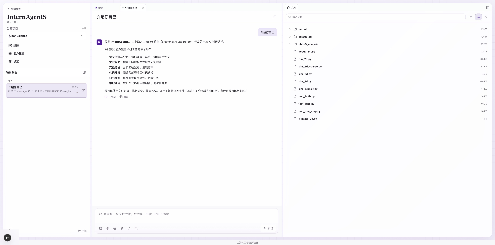
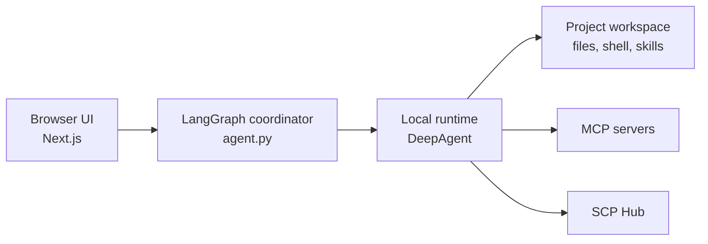

<div align="center">
  <p>
    
  </p>

  <h1 align="center">InternAgentS · 面向科研文件、代码、技能和计算资源的本地优先 Agent 工作台。</h1>
  <p align="center">
    基于 DeepAgents 和 LangGraph 扩展科研 Agent 运行时，连接项目上下文、文件系统、技能、远程资源和人工授权流程。
  </p>
  <p align="center">
    <a href="https://github.com/qzzqzzb/OpenClaudeScience/stargazers"></a>
    
    
    
    
    
    
  </p>
  <p align="center">
    <a href="./README.md">English</a> | <strong>简体中文</strong>
  </p>
  <p>
    <a href="#亮点">亮点</a>
    · <a href="#科研工作流示例">工作流</a>
    · <a href="#功能概览">功能概览</a>
    · <a href="#快速开始">快速开始</a>
    · <a href="#安全和隐私">安全</a>
    · <a href="#架构">架构</a>
    · <a href="#开发">开发</a>
    · <a href="#许可证">许可证</a>
  </p>
</div>

InternAgentS 为研究者和开发者提供一个本地优先的科研 Agent 工作台，用来完成论文阅读、实验分析、代码迭代、技能调用和计算资源协作等任务。项目基于 DeepAgents/LangGraph 开发，并在项目级 runtime、backend adapter、workspace protocol、技能目录、本地授权和远程资源协作等层面做了面向科研场景的扩展。

## 亮点

- 基于 DeepAgents/LangGraph 深度扩展：不止是对话入口，而是面向科研项目重组 runtime、workspace、skills、tools 和授权流程。
- 远程科研环境即插即用：连接 SSH workspace、同步 remote runtime、查看诊断日志，并在对话中确认远程计算任务。
- 内置大量科学技能：文献调研、实验结果分析、图表、论文写作、文档、幻灯片和领域 workflow 可以直接作为 skills 复用。
- 打通 MCP/SCP 和任意模型：可接 MCP/SCP 工具生态，也可使用云模型、私有网关或本地模型服务。
- 本地优先，数据不交出去：项目文件、密钥和运行状态默认留在你控制的机器上，不要求交给 Claude、Claude Science 或任何固定云端服务。
- 面向真实科研文件：支持 PDF、Office 文档、图片、分子结构、科学数据输出和生成 artifact 的浏览、搜索、preview 和引用。

## 科研工作流示例

- 论文和报告初筛：上传论文或 Markdown 报告，让 Agent 总结 claim、提取假设、比较方法，并把生成的笔记留在项目里。
- 科研产物检查：浏览项目文件，预览 PDF、Office 文件、图片、分子结构和科学数据输出，然后让 Agent 解释变化。
- 实验和代码迭代：让 Agent 检查代码、运行本地命令、创建结果文件，并用指向 workspace 文件的链接总结输出。
- Skill-guided sessions：启用文献检索、结果分析、图表、文档、幻灯片或领域科研 workflow 的可复用技能。
- 远程计算 handoff：注册 Linux SSH host，在对话中 review Agent 提出的 compute job，授权后由本地 backend 提交远程任务并回收产物。

### 分析 PbTiO3 钙钛矿结构在 A 位/B 位替换时可能带来的晶格畸变


### 咖啡因计算化学研究


### 建立一个 Y 型微流控混合器的简化模型


## 功能概览

InternAgentS 将会话、项目文件、技能入口和本地运行状态放在同一个科研工作台中。右侧面板保持项目文件和产物可见，中间区域专注当前对话任务，方便在阅读、分析、运行和整理之间切换。



### 本地优先的科研工作区

InternAgentS 采用三栏工作区：

| 区域 | 作用 |
| --- | --- |
| 左侧栏 | 项目导航、会话、设置和技能入口 |
| 中间 | chat、composer、附件、mention 和 Agent 进度 |
| 右侧面板 | 项目文件、preview、provenance、runtime 信息和 connector 上下文 |

项目文件通过 workspace API 访问，而不是让 UI 组件直接访问文件系统。文件面板支持目录导航、网格/列表视图、搜索，以及常见科研 artifact 的预览。

### Skills 和科学能力库

Skills 是可以为 Agent 或会话启用的可复用能力。InternAgentS 会先搜索用户共享 catalog，再搜索项目 catalog：

```text
~/.internagents/myskills
~/.internagents/imported-skills
skills
.internagents/imported-skills
```

设置 UI 支持 built-in skills、imported skills 和 science skills。导入的技能会复制到用户级 catalog，因此同一能力可以被多个 InternAgents 项目复用。

### 模型、授权和外观设置

统一设置页管理：

- model provider、Base URL、API key 和 model ID
- 项目目录
- Linux SSH compute host 注册和 job activity
- tool-call authorization mode
- 语言和外观
- archived conversations
- skills 和 connector 配置

UI 包含中文和英文文案。

### MCP 和 SCP Connectors

InternAgentS 可以通过 MCP server 配置加载外部工具，也可以为 science skill workflow 准备 SCP Hub 访问。

本地 MCP config 位置：

```text
~/.deepagents/.mcp.json
<repo>/.deepagents/.mcp.json
<repo>/.mcp.json
INTERNAGENT_MCP_CONFIG_FILE
```

Connector secrets、private commands、headers 和 endpoints 应保存在本地。

### Linux SSH Compute Jobs

InternAgentS 有一个实验性的 Linux-only SSH compute provider。它和 SSH remote runtime setup 是两个概念：本地 backend 保持当前会话，并向注册的 Linux SSH host 提交 detached jobs。

当前范围：

- 仅支持 Linux hosts。
- SSH hosts 通过本地 `~/.ssh/config` 里的 `Host` alias 注册。地址、用户、端口、`ProxyJump` 和 key 配置来自 OpenSSH。
- Jobs 在 per-job scratch directory 下作为 detached `bash` 进程运行。
- Job status 通过 SSH 轮询；匹配 configured globs 的输出会在大小限制内作为 base64 payload 回收。
- Settings > Compute 负责注册和探测 SSH hosts。Job submission 发生在对话中，由 Agent 提出 remote compute tool call。
- Proposed remote compute calls 会作为 permission cards 出现在 chat 中。用户必须 approve card，本地 backend 才会提交 SSH job。

本地 compute state 位于 `.internagents/compute/`，该目录被 git ignore。本地 API surface：

```text
GET  /api/compute/ssh-hosts
POST /api/compute/ssh-hosts
GET  /api/compute/remote-jobs
POST /api/compute/remote-jobs
GET  /api/compute/remote-jobs/:jobId
```

API 调用需要 `.internagents/compute/api-token` 中的本地 token：

```bash
TOKEN="$(cat .internagents/compute/api-token)"
curl -X POST http://127.0.0.1:3000/api/compute/ssh-hosts \
  -H 'Content-Type: application/json' \
  -H "X-InternAgents-Compute-Token: $TOKEN" \
  -d '{"host":"my-linux-host","notes":"Use sbatch on gpu partition; conda envs live under ~/envs."}'
```

## 快速开始

### 环境要求

- Python 3.11+
- Node.js 和 npm。UI 以 `ui/package-lock.json` 作为标准 lockfile。
- 一个 OpenAI-compatible 模型 endpoint，或者稍后在设置中配置。

### 启动工作台

```bash
cp .env.example .env
./scripts/dev.sh
```

启动脚本会准备本地环境并启动三个服务：

首次运行时，脚本会创建 `.venv`，以 editable mode 安装 Python 包，并在 `ui/` 下执行 `npm install --legacy-peer-deps --ignore-scripts`。只有在这些依赖已经安装完成之后，才建议使用 `INTERNAGENTS_SKIP_INSTALL=1`。

| 服务 | 默认地址 | 作用 |
| --- | --- | --- |
| UI | `http://127.0.0.1:3000` | Next.js 工作台 |
| Coordinator | `http://127.0.0.1:2024` | 工作台前端连接的 LangGraph API |
| Local runtime | `http://127.0.0.1:22024` | 项目级 DeepAgent runtime |

打开：

```text
http://127.0.0.1:3000/?assistantId=agent_local
```

日志写入：

```text
.internagents/logs/backend.log
.internagents/logs/local-runtime.log
.internagents/logs/ui.log
```

在启动脚本所在终端按 `Ctrl+C` 可以停止由脚本启动的服务。

### 配置模型

你可以在首次设置时配置模型，也可以跳过后稍后从 Settings 返回配置。OpenAI-compatible endpoint 示例：

```env
INTERNAGENTS_MODEL_PROVIDER=openai_compatible
OPENAI_BASE_URL=https://api.example.com/v1
OPENAI_API_KEY=sk-...
DEEPAGENT_MODEL=your-model-id
```

DeepSeek 官方 OpenAI-compatible endpoint 也可以使用 provider-specific alias：

```env
DEEPSEEK_API_KEY=
DEEPSEEK_BASE_URL=https://api.deepseek.com
DEEPSEEK_MODEL=deepseek-chat
```

当选择 OpenAI-compatible provider 时，`DEEPSEEK_API_KEY`、`DEEPSEEK_BASE_URL` 和 `DEEPSEEK_MODEL` 会被视为对应 OpenAI-compatible API key、base URL 和 model 的别名。

请把 API key 和机器相关路径保存在本地 `.env` 或 runtime config 文件中，不要提交密钥。

### 常用启动参数

```bash
INTERNAGENTS_UI_PORT=3001 ./scripts/dev.sh
INTERNAGENTS_BACKEND_PORT=2025 ./scripts/dev.sh
INTERNAGENTS_OPEN_BROWSER=0 ./scripts/dev.sh
INTERNAGENTS_SKIP_INSTALL=1 ./scripts/dev.sh
```

## 安全和隐私

InternAgentS 默认 local-first。项目文件通过 workspace API 访问，runtime state 保存在 `.internagents/` 等本地目录下。

- 把 model API keys、MCP headers、SCP Hub keys、server addresses、SSH aliases 和机器相关路径保存在本地 `.env` 或 runtime config 文件中。
- 不要提交 `.env`、`internagent.resources.local.json`、private SSH material、logs、pids、uploads、LangGraph state 或 active skill runtime directories。
- Tool-call authorization modes 可以要求在文件写入或其他动作前获得授权。SSH compute jobs 总是在提交前显示 approval cards。
- 连接远程 Agent service 时，请先确认服务 endpoint：远程服务拥有自己的 workspace、tools 和 resource policy。
- Connector 配置应让 secrets 留在本地。共享示例应脱敏，并优先使用 placeholder endpoints 和 keys。

## 架构



## 仓库结构

```text
agent.py                         LangGraph graph assembly and assistant exports
deepagent.config.json            local backend, skills, model, and UI defaults
internagent_resources.py         resource configuration loader
ssh_backend.py                   SSH-backed workspace adapter
thread_skill_middleware.py       thread-level skill loading
mcp_config.py / mcp_tools.py      MCP configuration and tool loading
scripts/dev.sh                   one-command local development launcher
ui/                              Next.js workbench UI
skills/                          bundled project skills
docs/                            user guides and design notes
```

## 开发

打开 PR 前建议运行：

```bash
git diff --check
python3 -m json.tool deepagent.config.json >/dev/null
python3 -m json.tool internagent.resources.json >/dev/null
python3 -m json.tool ui/deepagent-ui.config.json >/dev/null
npm --prefix ui run lint
(cd ui && npx tsc --noEmit)
npm --prefix ui run build
```

Python backend 改动建议运行：

```bash
.venv/bin/python -m compileall agent.py internagent_resources.py ssh_backend.py kb_sync_middleware.py thread_skill_middleware.py
.venv/bin/python -c "import agent; print(agent.MODEL)"
```

## 贡献

InternAgentS 是一个开放科研工具。欢迎贡献：

- 带清晰复现步骤的 bug reports
- 保持现有 workflow 稳定的 UI polish
- 带示例和安全默认值的新 skills
- 将 secrets 留在本地的 connector integrations
- 安装、配置和科研 workflow 文档

请保持改动范围清晰。DeepAgents 被视为外部 SDK，InternAgentS 应通过公开 API、adapters、middleware、tools 和本地 resource configuration 扩展它，而不是 patch SDK internals。

## 许可证

InternAgentS 基于 [MIT License](LICENSE) 发布。

## Roadmap Notes

近期工作方向：

- 更清晰的 skill marketplace 和 installation flow
- 更强的 MCP 和 SCP 配置 UX
- 更丰富的科学 artifact previews
- 更好的 remote resource management
- packaged desktop workflows

这个 README_CN 保持相对轻量。更详细的设计记录位于 `docs/`，公开 onboarding 叙事会随着界面稳定持续演进。
