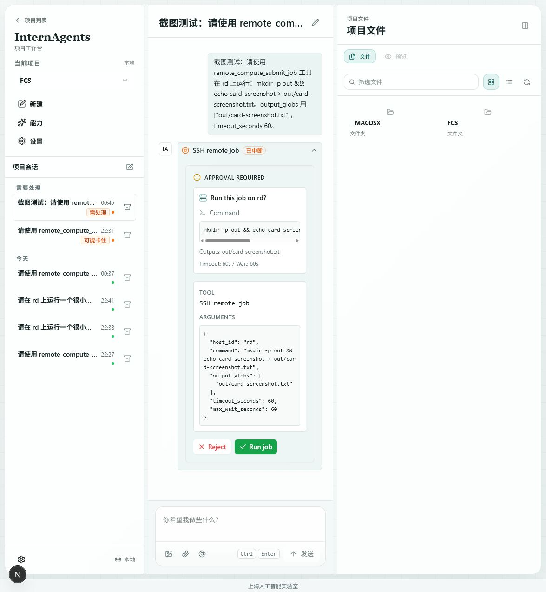
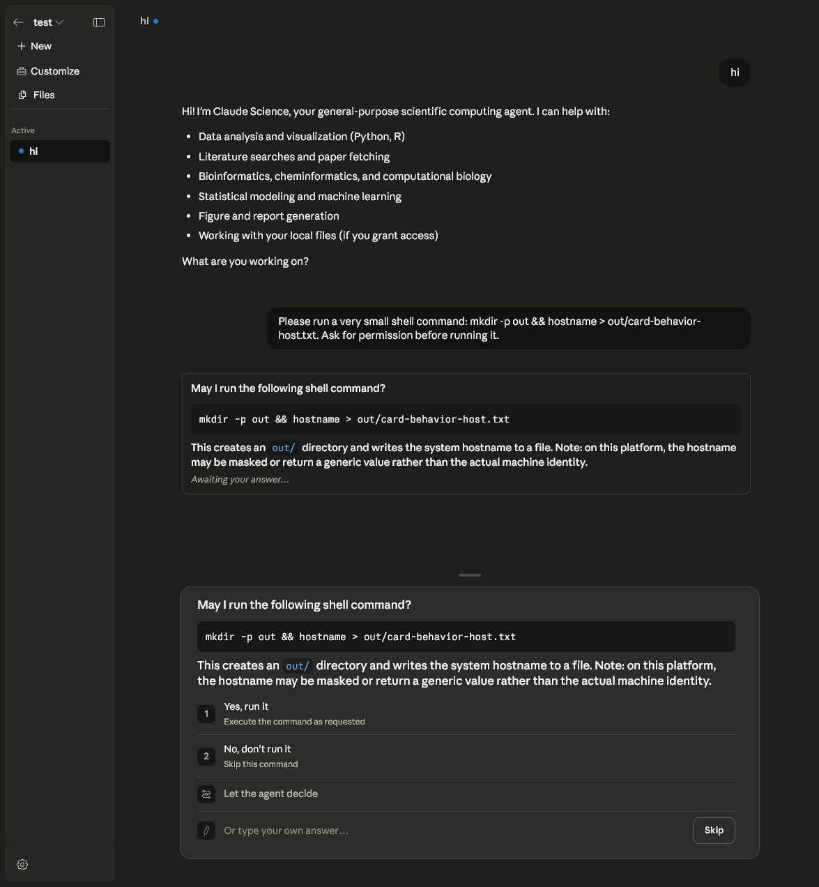

# Remote Compute Permission Card Comparison

Date: 2026-07-03

Purpose: record the visible permission-card behavior used by the current
OpenClaudeScience remote compute implementation and compare it with Claude
Science's original shell-command permission card.

## OpenClaudeScience Adapter Card

Observed behavior:

- The interrupted tool step is shown inline as `SSH remote job`.
- The card title asks `Run this job on rd?`.
- The command is shown before approval.
- Output globs and timeout/wait settings are visible.
- The full raw arguments remain visible in the card.
- Available decisions are `Reject` and `Run job`; `Edit` is intentionally absent
  for `remote_compute_submit_job`.
- The test card was rejected after the screenshot so no extra SSH job was run
  from this screenshot-only session.

## Claude Science Original Card

Observed behavior:

- Claude Science first writes a normal assistant message asking permission:
  `May I run the following shell command?`
- The command is shown in a code block.
- A short natural-language explanation appears under the command.
- A bottom permission panel repeats the command and explanation.
- Available decisions are `Yes, run it`, `No, don't run it`, `Let the agent
  decide`, a custom answer input, and `Skip`.
- The test card was rejected after the screenshot so the command was not run.

## Design Notes

- Our current card is stricter for remote SSH jobs: it permits only approve or
  reject because editing the tool call would not be accepted by the backend HITL
  config.
- Claude Science exposes richer conversational alternatives, including custom
  answers and letting the agent decide. Those are useful for general shell
  permissions, but remote compute should keep the approval surface explicit until
  the adapter has a safe edit/custom-answer protocol.
- Both surfaces show the command before execution. Our implementation should
  continue to show host, command, outputs, timeout, and raw arguments before
  approval.
