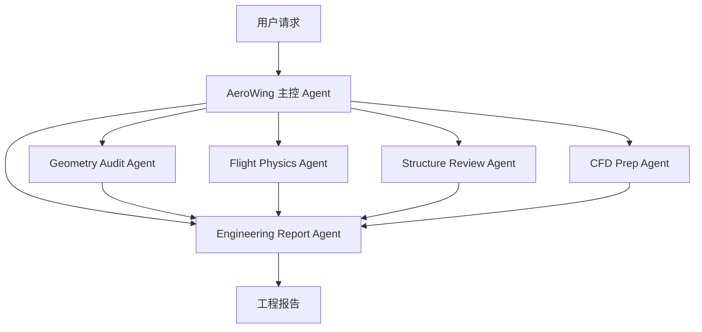

有考虑，但你指出得对：我后面那版把“适配器/异步 Job”的技术路线展开了，导致看起来像另一套路线。实际上它们应该合并成一条更清晰的路线。

我重新综合一下，最终建议应该是这个版本。

------

# 最终总路线

核心原则不变：

> **先把专业能力做实，再把多 Agent 产品化。**
> **前端只展示，后端做计算，重型任务走异步 Job。**

最终路线是：

```
第 1 阶段：基础体验修稳
第 2 阶段：航空专业 Skill + 轻量工具做实
第 3 阶段：右侧面板专业分析产品化
第 4 阶段：异步 Job 与外部工具适配基础
第 5 阶段：专家 Agent 配置入口
第 6 阶段：真正多 Agent 编排
第 7 阶段：仿真/求解器集成
```

相比我前面第一版，多加了一个“第 4 阶段：异步 Job 与外部工具适配基础”。
这个阶段是为了避免前端卡死，也为了后面接求解器做准备。

------

# 第 1 阶段：基础体验修稳

目标：让用户愿意继续用。

当前你已经遇到的几个问题都属于这一阶段：

- 中文切设置变英文
- 文件树切换预览后折叠状态丢失
- NASA X-59 大 STL 加载慢/不显示
- 右侧 3D Viewer 对大模型不稳定
- 大文件解析等待时间太长

这一阶段重点不是“更多功能”，而是稳定。

## 该做什么

### 1.1 语言状态统一

已经修了一版，但还可以继续完善：

- 浏览器语言优先
- 后端 `ui_language` 只作为首次默认值
- 只有用户在设置页主动切换语言才写入全局语言
- 设置页不能无感覆盖对话页语言

### 1.2 文件树状态保持

已经修了一版：

- 文件页和预览页保持挂载
- 切换 tab 不卸载文件树
- 展开状态保留

### 1.3 大模型 3D Viewer 修稳

已经修了“坐标居中”问题。

下一步需要：

- 大 STL 自动降采样
- 大模型默认关闭全边线
- loading 文案明确
- 失败提示明确
- 第二次打开缓存

### 1.4 CAE 预览稳定性

右侧面板应该清楚显示：

```
正在生成 3D 预览...
正在生成 CAE 摘要...
文件较大，可能需要几十秒...
解析失败：xxx
```

------

# 第 2 阶段：航空专业 Skill + 轻量工具做实

目标：不要只“展示飞机”，要开始“理解飞机”。

这一阶段只接轻量、开源、跨平台、适合后端 Python 的工具。

## 立即接入工具

```
numpy
trimesh
meshio
pyNastran 已接入
```

这些是后端工具，不在前端跑。

### 为什么是这几个

| 工具        | 用途                                           |
| ----------- | ---------------------------------------------- |
| `pyNastran` | BDF/OP2 真实有限元读取                         |
| `numpy`     | 几何/物理基础计算                              |
| `trimesh`   | STL/OBJ/PLY 三角网格分析、体积、表面积、封闭性 |
| `meshio`    | VTK/VTU/INP/STL 等网格格式桥接                 |

## 2.1 Aircraft Geometry Audit Skill

第一优先级。

新增：

```
skills/aircraft-geometry-audit/
  SKILL.md
  tools/
    audit_geometry.py
```

功能：

- 长度
- 翼展
- 高度
- 包络盒
- 三角面数量
- 表面积
- 体积
- 是否封闭
- 非流形边
- 退化三角
- CFD/FEM/3D 打印适用性判断
- Markdown 报告

这个直接服务 NASA X-59。

------

## 2.2 Flight Condition Calculator Skill

第二优先级。

新增：

```
skills/flight-condition-calculator/
  SKILL.md
  tools/
    flight_condition.py
```

功能：

- 标准大气
- 马赫数
- 速度
- 动压
- 雷诺数
- 升力系数需求
- 载荷工况

这个是物理计算 Skill，不需要外部求解器。

------

## 2.3 Nastran Structure Review Skill

第三优先级。

新增或深化：

```
skills/nastran-structure-review/
  SKILL.md
  tools/
    review_bdf.py
    review_op2.py
    write_structure_report.py
```

功能：

- 材料/属性/载荷/约束完整性
- 单元质量风险
- Case Control 检查
- OP2 位移/应力/模态摘要
- 风险等级报告

------

# 第 3 阶段：右侧面板专业分析产品化

目标：把 Skill 结果从“文件产物”变成“产品界面”。

现在右侧面板已有：

```
3D Viewer
CAE 摘要
```

应该升级成：

```
3D Viewer
CAE 摘要
几何体检
结构检查
飞行工况
工程建议
报告产物
```

## 推荐右侧面板结构

```
┌─────────────────────────────┐
│ 3D CAE Viewer                │
│ 快速预览 / 原始模型信息       │
├─────────────────────────────┤
│ CAE 摘要                     │
│ nodes / elements / materials │
├─────────────────────────────┤
│ 几何体检                     │
│ length / span / height       │
│ watertight / non-manifold    │
├─────────────────────────────┤
│ 工程建议                     │
│ CFD readiness                │
│ FEM readiness                │
├─────────────────────────────┤
│ 报告                         │
│ 打开 / 重新生成 / 导出        │
└─────────────────────────────┘
```

## 新 API

可以逐步加：

```
/api/workspace/geometry-audit
/api/workspace/flight-condition
/api/workspace/structure-review
```

注意：这些 API 先可以同步，但一旦超过 5-10 秒，就迁移到异步 Job。

------

# 第 4 阶段：异步 Job 与外部工具适配基础

这是我后面补充的内容，应该放在多 Agent 之前、求解器之前。

目标：防止前端卡死，为后续求解器运行打基础。

## 4.1 异步 Job 系统

凡是重任务都不要同步阻塞前端。

新增：

```
POST /api/jobs
GET /api/jobs/:jobId
GET /api/jobs/:jobId/logs
DELETE /api/jobs/:jobId
```

Job 类型：

```
mesh_preview
geometry_audit
nastran_review
op2_extract
solver_detect
solver_prepare
solver_run
```

文件存储：

```
.internagents/jobs/
  job-id/
    job.json
    stdout.log
    stderr.log
    result.json
    artifacts/
```

第一版不用数据库。

------

## 4.2 可选适配器先做“检测”

你问得很关键：适配器不是前端跑，是后端桥接外部工具。

这一阶段只做检测，不跑重型求解。

检测：

```
SU2
OpenFOAM
CalculiX
Nastran
Abaqus
OptiStruct
```

输出：

```
{
  "su2": {
    "available": false,
    "hint": "未检测到 SU2_CFD"
  },
  "calculix": {
    "available": true,
    "path": "..."
  }
}
```

## 4.3 Case Skeleton 生成

先不求解，只生成工程目录。

例如：

```
cases/
  x59_su2/
    config.cfg
    README.md

  x59_openfoam/
    0/
    constant/
    system/
    README.md

  structure_calculix/
    model.inp
    README.md
```

这样可以让用户看到平台开始具备仿真前处理能力，但不冒然跑重型任务。

------

# 第 5 阶段：专家 Agent 配置入口

现在才做设置页专家 Agent，顺序更合理。

因为此时已经有真实 Skill 和工具作为支撑。

## 设置页新增

```
专家 Agent
```

第一版只做内置模板开关：

- Geometry Audit Agent
- Flight Physics Agent
- Structure Review Agent
- CFD Prep Agent
- CAE Parser Agent
- Engineering Report Agent

保存到：

```
deepagent.config.json
```

字段：

```
"subagents": [
  {
    "name": "geometry-audit-agent",
    "description": "Audit aircraft geometry and mesh quality."
  }
]
```

## 第一版不要做

先不要做：

- 拖拽编排
- 每个 Agent 单独模型
- 每个 Agent 单独权限
- 复杂 prompt 编辑器
- Agent 运行图谱

先让它成为“高级设置入口”。

------

# 第 6 阶段：真正多 Agent 编排

目标：用户自然语言提出复杂任务，系统自动分派专家。

例如用户说：

```
分析这个 X-59 STL 是否适合做 CFD 和结构有限元，并给出工程报告。
```

内部：

````

````

用户不用手动选 Agent。

## 这一阶段做

- 专家 Agent prompt
- 分派规则
- 输出 JSON schema
- 汇总报告
- 前端显示：
  - 哪个 Agent 在工作
  - 哪个 Agent 产出了什么
  - 哪个 Agent 失败了

------

# 第 7 阶段：仿真/求解器集成

最后才做真正求解器运行。

## 原则

- 必须异步 Job
- 必须用户确认
- 必须可取消
- 必须有超时
- 必须写日志
- 必须限制工作目录
- 前端只轮询状态和显示结果

## 推荐接入顺序

### 7.1 CalculiX

先结构小案例，比较容易控。

### 7.2 SU2

再做 CFD 入门案例。

### 7.3 OpenFOAM

功能强但工程复杂，放后面。

### 7.4 商业求解器

只做路径配置和调用适配：

- MSC/NX Nastran
- Abaqus
- OptiStruct
- Fluent

不内置、不分发、不自动安装。

------

# 最终执行顺序清单

你可以按这个执行：

```
1. 修稳基础体验
   1.1 语言状态
   1.2 文件树状态
   1.3 大 STL 显示
   1.4 加载/错误提示

2. 接轻量后端工具
   2.1 numpy
   2.2 trimesh
   2.3 meshio
   2.4 深化 pyNastran

3. 做航空专业 Skill
   3.1 aircraft-geometry-audit
   3.2 flight-condition-calculator
   3.3 nastran-structure-review

4. 产品化右侧 CAE 面板
   4.1 几何体检卡片
   4.2 工程建议卡片
   4.3 报告入口
   4.4 缓存和重跑按钮

5. 做异步 Job 基础
   5.1 Job API
   5.2 文件系统 Job 存储
   5.3 日志/状态/取消
   5.4 大任务迁移到 Job

6. 做外部工具适配基础
   6.1 detect_solvers.py
   6.2 设置页显示求解器状态
   6.3 Case skeleton 生成
   6.4 不直接跑求解器

7. 做 Expert Agents 设置入口
   7.1 内置航空专家模板
   7.2 启用/禁用
   7.3 写入 subagents
   7.4 不做复杂编排

8. 做真正多 Agent 编排
   8.1 主控 Agent 分派
   8.2 专家 Agent 输出结构化结果
   8.3 Report Agent 汇总
   8.4 前端显示 Agent 过程

9. 接真实求解器
   9.1 CalculiX
   9.2 SU2
   9.3 OpenFOAM
   9.4 商业求解器路径适配
```

------

# 当前下一步最应该做什么

如果现在就继续开发，我建议直接做：

```
Step A：接入 numpy/trimesh/meshio
Step B：优化 STL 大模型预览降采样
Step C：做 aircraft-geometry-audit Skill
Step D：右侧 CAE 面板显示几何体检
```

这是最短闭环，也是当前最能让你看到产品价值的一步。

你点开 X-59 后，理想效果应该是：

```
上方：快速 3D 预览，几秒显示
中间：CAE 摘要
下方：几何体检
  - 长度
  - 翼展
  - 高度
  - 表面积
  - 是否封闭
  - 非流形边
  - CFD/FEM 建议
```

这样“空中之翼”就从“能打开飞机模型”升级成“能做航空几何工程初筛”。