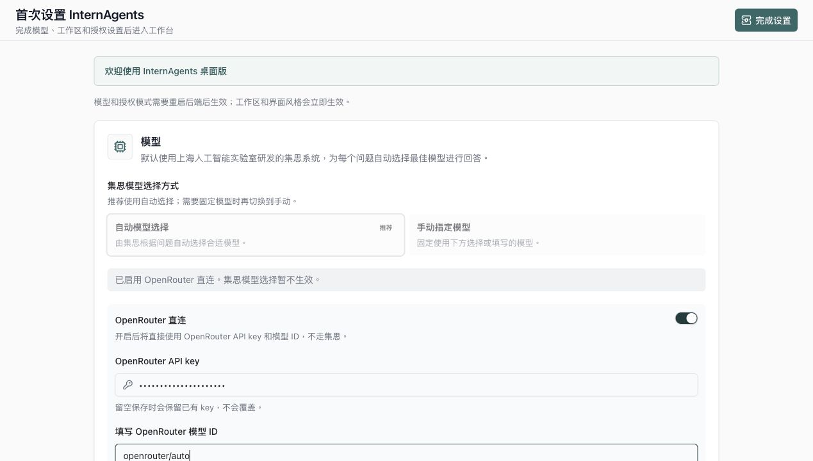
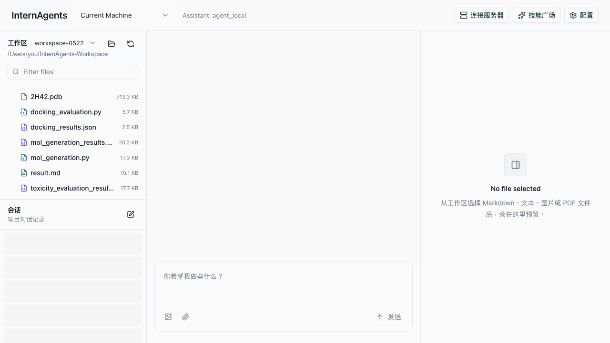
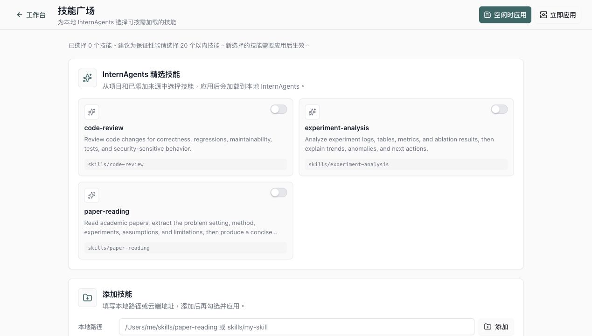

# InternAgents 桌面版用户手册

这份手册写给第一次使用 InternAgents 的 macOS 用户。你不需要懂命令行，打开后会先进入工作台并显示快速导览；需要更换模型、API key、工作区或授权模式时，再进入配置页调整。

## 1. 安装和打开

1. Apple Silicon Mac 双击 `InternAgents-0.1.0-arm64.dmg`；Intel Mac 双击 `InternAgents-0.1.0-x64.dmg`。
2. 把 `InternAgents` 拖到 `Applications`（应用程序）文件夹。
3. 在「应用程序」里打开 `InternAgents`。

如果 macOS 提示“无法验证开发者”，可以在「应用程序」里按住 `Control` 点 `InternAgents`，选择「打开」。第一次打开后，以后通常就可以直接双击打开。

## 2. 第一次打开

第一次启动会直接进入本地工作台，并显示 Quickstart 导览。



默认模型配置已经写入应用配置。真实 API key 不会提交到仓库；如果你需要手动填写或更换 key，可以稍后打开「配置」页面。

配置页里可以调整 4 件事：

### 2.1 OpenAI 兼容接口

这是模型服务的连接信息。选择 `OpenAI 兼容` 后，填写服务商提供的 Base URL 和 API key。

注意：

- API key 只保存在这台 Mac 的 InternAgents 设置里。
- 不要把 API key 发给别人，也不要写进论文、文档或聊天记录。
- 如果你之前已经保存过 key，输入框可以留空，保存时不会覆盖旧 key。

### 2.2 模型

最简单的用法：

- 选择 `OpenAI 兼容`
- Base URL 可以先填 `https://openrouter.ai/api/v1`
- 模型 ID 可以先填服务商推荐的模型，例如 `deepseek/deepseek-v4-pro`

如果你已经知道要用哪个模型，也可以填具体模型 ID，例如：

```text
deepseek/deepseek-v4-pro
```

页面里的「集思模型」适合已经接入集思模型服务的环境。普通用户不知道怎么选时，可以先使用 OpenAI 兼容接口配一个已有服务商。

### 2.3 工作区

工作区就是 InternAgents 能看到和操作的文件夹。

默认建议使用：

```text
~/InternAgents-Workspace
```

你可以把论文、数据说明、项目文档、Markdown、PDF 等文件放进去。之后左侧「工作区」会显示这些文件，Agent 也会以这个文件夹为工作范围。

### 2.4 授权模式

授权模式决定 Agent 调用工具时是否需要你确认。

推荐新用户选择：

```text
自动授权
```

如果你的工作区里有重要数据，或者你希望每次写文件、改文件前都确认，可以选更严格的授权模式。

填完后点击右上角 `完成设置`。应用会自动进入工作台。

## 3. 工作台长什么样

工作台分成三块：



- 左上：`工作区`，显示当前文件夹里的文件。
- 左下：`会话`，显示历史对话。
- 中间：聊天区，直接向 InternAgents 提问题。
- 右侧：文件预览区，点选 Markdown、文本、图片或 PDF 后会显示内容。

## 4. 最常用的几种用法

### 4.1 直接提问

在底部输入框输入问题，例如：

```text
帮我总结这篇论文的研究问题、方法和主要结论。
```

或者：

```text
帮我检查这个项目的 README，指出缺少哪些实验说明。
```

### 4.2 让它看工作区文件

把文件放到 `InternAgents-Workspace` 后，回到 App 左侧点击刷新图标。你可以：

- 点击文件，在右侧预览。
- 在聊天里说“请阅读工作区里的 xxx.md，并总结关键结论”。
- 让它比较多个文档、整理表格、生成实验摘要。

### 4.3 上传附件

聊天输入框左下角有附件按钮。适合临时发一张图、一段文本或一个文件，让 Agent 结合当前问题分析。

建议：

- 长期要用的资料放进工作区。
- 临时资料用附件。

### 4.4 使用 `/goal` 长任务

如果你希望它持续推进一个较长目标，可以在问题前加 `/goal`。

例子：

```text
/goal 帮我找 10 篇 Intern 系列模型的论文，整理标题、年份、链接和一句话贡献。
```

`/goal` 适合：

- 文献调研
- 多文件整理
- 实验结果汇总
- 项目代码初步审阅

如果只是问一个简单问题，不需要加 `/goal`。

## 5. 技能广场

顶部点击 `技能广场` 可以进入技能页面。



技能是给 Agent 增加专长的小工具包。比如：

- `paper-reading`：更适合读论文
- `experiment-analysis`：更适合分析实验结果
- `code-review`：更适合检查代码改动

使用方式：

1. 打开你需要的技能开关。
2. 点击右上角 `立即应用`。
3. 回到工作台继续提问。

新用户可以先不改技能。等你发现某类任务经常做，再打开对应技能。

## 6. 配置页

顶部点击 `配置` 可以随时修改：

- 模型和 API key
- 工作区路径
- 授权模式
- 界面风格

修改模型、API key 或授权模式后，需要应用配置。工作区路径通常会立即生效。

## 7. 常见问题

### Q1：我应该把论文放在哪里？

放到：

```text
~/InternAgents-Workspace
```

然后回到 App，点击左侧工作区旁边的刷新按钮。

### Q2：为什么左侧没有看到我的文件？

检查三件事：

1. 文件是不是放在当前工作区里。
2. 是否点了刷新按钮。
3. 配置页里的 `本机工作区路径` 是否指向正确文件夹。

### Q3：API key 填错了怎么办？

进入 `配置`，重新粘贴正确的 API key，然后保存并应用。

### Q4：我不懂模型 ID，填什么？

先填：

```text
deepseek/deepseek-v4-pro
```

能跑起来后，再根据团队建议换具体模型。

### Q5：什么时候用 `/goal`？

任务很长、需要分步骤推进时用 `/goal`。例如“找 10 篇论文并整理表格”。普通问答不用。

### Q6：它会不会乱改我的文件？

InternAgents 的操作范围主要在你设置的工作区里。新用户建议先使用 `自动授权` 熟悉流程；如果你希望写文件前都确认，可以在配置页选择更严格的授权模式。

## 8. 一个推荐的新手流程

1. 安装并打开 InternAgents。
2. 选择 OpenAI 兼容接口，填 Base URL 和 API key。
3. 模型先填服务商推荐的模型 ID。
4. 工作区使用默认的 `~/InternAgents-Workspace`。
5. 把论文或项目文件放进工作区。
6. 回到工作台刷新文件列表。
7. 先问一个简单问题：

```text
请阅读工作区里的文件，告诉我这里主要有哪些研究内容。
```

8. 熟悉后再使用 `/goal` 做长任务。
