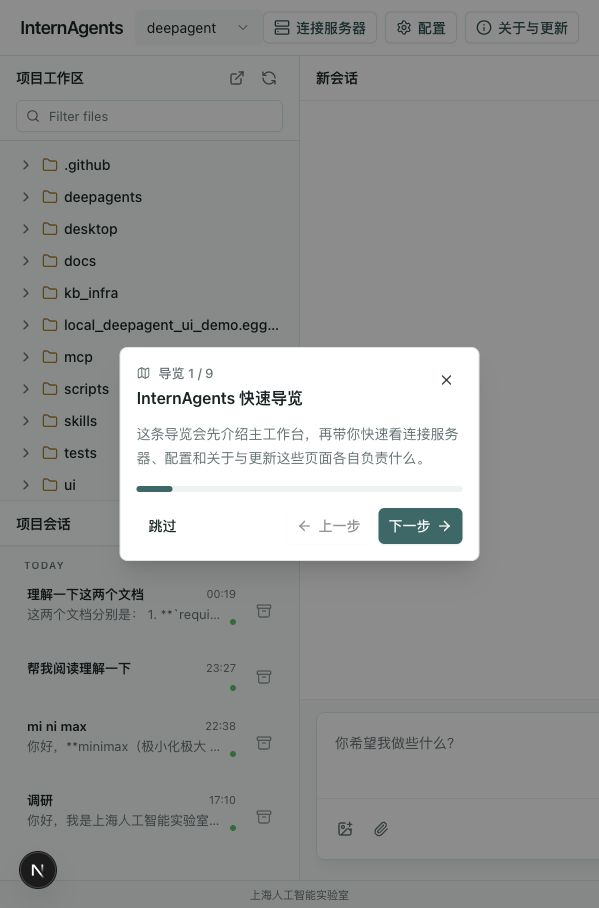
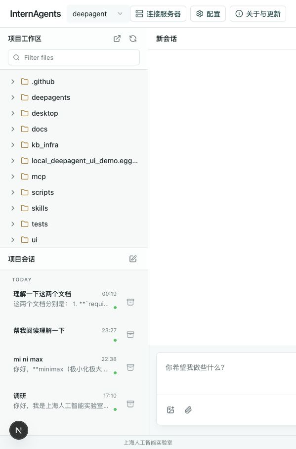
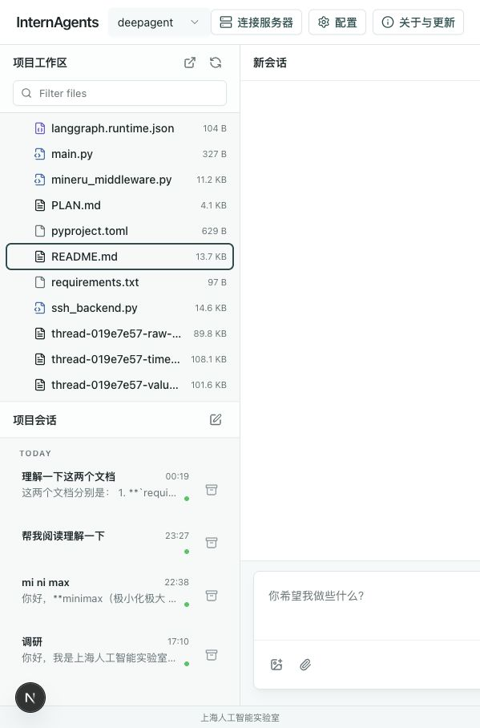
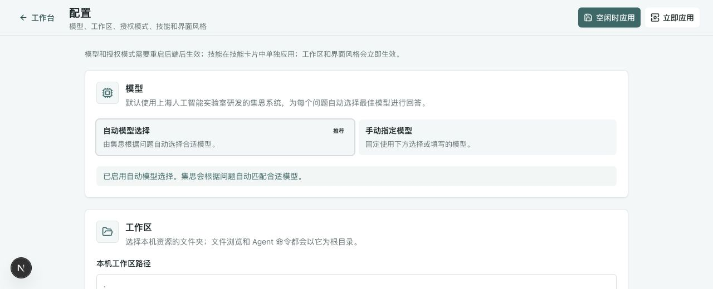
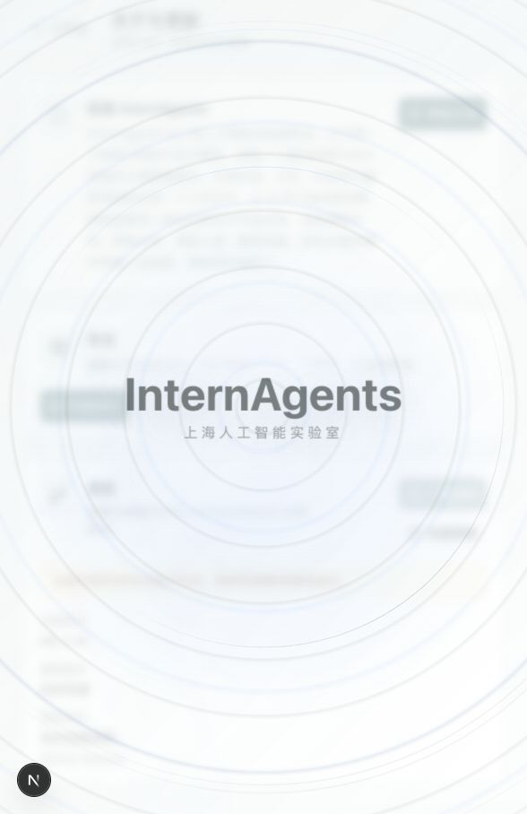

# InternAgents 用户手册（新手版）

这份手册写给第一次使用 InternAgents 的用户。你可以把它当作一份“照着点”的操作说明：先进入工作台，再放入资料、发起任务、查看结果，最后根据需要配置模型、技能和更新。

> 说明：截图来自当前本地开发版界面。桌面正式版和不同部署环境的按钮位置可能略有差异，但核心流程一致。

## 目录

1. [InternAgents 是什么](#internagents-是什么)
2. [进入 InternAgents](#进入-internagents)
3. [第一次打开：快速导览](#第一次打开快速导览)
4. [认识工作台](#认识工作台)
5. [准备工作区文件](#准备工作区文件)
6. [发送第一个任务](#发送第一个任务)
7. [常见任务傻瓜式教程](#常见任务傻瓜式教程)
8. [会话管理](#会话管理)
9. [附件和文件预览](#附件和文件预览)
10. [审批和安全](#审批和安全)
11. [配置页面](#配置页面)
12. [技能](#技能)
13. [远程 Agent 服务说明](#远程-agent-服务说明)
14. [关于、导览和更新](#关于导览和更新)
15. [常见问题](#常见问题)
16. [推荐新手流程](#推荐新手流程)

## InternAgents 是什么

InternAgents 是一个面向科研、代码和技术探索的智能体工作台。它不仅能聊天，还能围绕一个工作区读取文件、理解文档、拆解任务、生成内容、调用工具，并在需要时让用户审批关键操作。

你可以用它做这些事：

- 阅读论文、PDF、Markdown、代码和实验记录。
- 总结材料，提炼研究问题、方法、贡献和局限。
- 对比多个文件，整理表格或待办事项。
- 让它在项目中搜索、阅读、解释代码。
- 让它生成草稿、报告、脚本或修改建议。
- 把较长目标交给 `/goal`，让它分步骤推进。

最重要的概念只有两个：

- 工作区：InternAgents 能看到和操作的文件夹。
- 会话：你和 InternAgents 围绕某个问题的一段对话记录。

## 进入 InternAgents

### 方法 A：桌面版用户

如果你拿到的是桌面应用：

1. 打开 `InternAgents` 应用。
2. 等待本地服务启动完成。
3. 应用会自动进入工作台。

如果第一次打开时 macOS 提示无法验证开发者，可以在“应用程序”中按住 `Control` 点 `InternAgents`，再选择“打开”。

### 方法 B：源码开发版用户

如果你是在本仓库中运行开发版，从仓库根目录执行：

```bash
cp .env.example .env
./scripts/dev.sh
```

启动完成后打开：

```text
http://127.0.0.1:3000/?assistantId=agent_local
```

如果默认端口被占用，可以换端口：

```bash
INTERNAGENTS_UI_PORT=3001 INTERNAGENTS_BACKEND_PORT=2025 ./scripts/dev.sh
```

开发版日志在：

```text
.internagents/logs/backend.log
.internagents/logs/local-runtime.log
.internagents/logs/ui.log
```

## 第一次打开：快速导览

第一次进入工作台时，会出现快速导览。导览会依次介绍当前项目、工作区、聊天区、会话列表、配置和更新。



你可以这样操作：

1. 点击 `下一步`，跟着导览看完每个区域。
2. 已经熟悉界面时，点击 `跳过`。
3. 以后想重新看导览，进入 `关于与更新`，点击 `开始导览`。

新手建议先看完导览。它不会改变文件，也不会发起任务，只是带你认识界面。

## 认识工作台

主工作台大致分成三列：



### 顶部栏

顶部栏包含这些入口：

- `InternAgents`：当前应用名称。
- 项目/资源下拉框：切换本地工作区或已配置的 Agent 服务。
- `配置`：设置模型、工作区、授权模式、技能和界面风格。
- `关于与更新`：查看应用介绍、重新打开导览、检查更新。

当前版本不会在顶部栏展示 `连接服务器` 入口。普通用户默认使用本机服务即可，不需要手动配置远程 Agent 服务。

### 左侧上方：项目工作区

这里显示当前工作区中的文件和文件夹。

常用操作：

- 点击文件夹：展开或收起。
- 点击文件：在右侧预览。
- 点击刷新按钮：重新加载文件列表。
- 点击打开文件夹按钮：用系统文件管理器打开当前工作区。
- 在 `Filter files` 输入关键词：过滤文件列表。
- 把文件拖到聊天区：作为附件加入当前问题。

### 左侧下方：项目会话

这里显示当前项目的历史会话。

常用操作：

- 点击某个会话：继续之前的对话。
- 点击新建会话按钮：开始新问题。
- 点击归档按钮：把不常用的会话收起。

会话会按时间分组，例如 `Today`、`Yesterday`、`This Week`。如果某个会话需要你处理审批，会显示在需要关注的分组里。

### 中间：聊天区

这里是你发任务和看回复的地方。

底部输入框可以输入自然语言，例如：

```text
请阅读工作区里的 README.md，用中文总结这个项目是做什么的。
```

输入框左下角有两个附件按钮：

- 图片按钮：添加图片。
- 回形针按钮：添加文本文件或 PDF。

右下角按钮：

- `发送`：提交任务。
- `停止`：任务运行时可中止当前输出。

### 右侧：文件预览区

你在左侧点选文件后，右侧会显示文件内容。



支持预览的常见类型：

- Markdown：`.md`、`.mdx`
- 文本和代码：`.txt`、`.py`、`.ts`、`.json`、`.sh` 等
- PDF：`.pdf`
- 图片：常见图片格式

如果某个文件太大或类型不支持，右侧会提示无法直接预览。你仍然可以让 Agent 在任务中读取或处理合适的文件。

## 准备工作区文件

工作区是 InternAgents 的“活动范围”。新手可以这样理解：

```text
你把资料放进工作区，InternAgents 才能围绕这些资料工作。
```

### 第一步：确认当前工作区

在顶部项目/资源下拉框中，看当前选中的项目名称。

如果要换文件夹：

1. 点击顶部项目/资源下拉框。
2. 选择已有工作区，或点击 `打开或新增工作区`。
3. 选择你要使用的本机文件夹。
4. 回到左侧 `项目工作区`，确认文件列表是否变成新文件夹内容。

### 第二步：放入资料

把这些文件放进工作区：

- 论文 PDF
- README 或说明文档
- Markdown 笔记
- 实验日志
- 代码项目
- CSV / JSON / 文本数据说明

建议新手先用一个干净的小文件夹练习，里面只放本次任务要用的材料。

### 第三步：刷新文件列表

如果你刚把文件复制进去，但左侧没有显示：

1. 点击左侧 `项目工作区` 右上角的刷新按钮。
2. 如果还没有显示，确认文件是否真的在当前工作区文件夹内。
3. 再去 `配置` 页面检查 `本机工作区路径` 是否正确。

## 发送第一个任务

最简单的流程：

1. 在左侧找到目标文件。
2. 点击文件，在右侧确认可以预览。
3. 在中间输入框输入任务。
4. 点击 `发送`。
5. 等待 InternAgents 回复。

推荐第一个任务：

```text
请先只读工作区里的 README.md，不要修改文件。用 5 点总结这个项目的用途、主要模块和启动方式。
```

为什么建议加上“先只读”：

- 新手更容易理解它在做什么。
- 可以先确认它读对了文件。
- 后续再让它写文件或修改代码会更稳。

## 常见任务傻瓜式教程

### 任务 1：总结一篇论文 PDF

适合场景：你有一篇论文，想快速知道它讲了什么。

操作步骤：

1. 把论文 PDF 放进工作区。
2. 在左侧刷新文件列表。
3. 点击 PDF，确认右侧能预览。
4. 在聊天框输入：

```text
请阅读工作区里的 paper.pdf，并用中文总结：
1. 研究问题是什么
2. 方法核心思想是什么
3. 主要实验和结果是什么
4. 这篇论文的贡献是什么
5. 有哪些局限或可继续研究的方向
请先不要写文件，只在聊天里回答。
```

如果 PDF 很长，可以改成：

```text
请先快速浏览 paper.pdf，告诉我它的章节结构和最值得细读的部分。
```

### 任务 2：比较多篇文档

适合场景：你有多个方案、论文摘要或实验说明，想找差异。

操作步骤：

1. 把多个文件放进工作区，例如 `method-a.md`、`method-b.md`、`method-c.md`。
2. 输入：

```text
请比较 method-a.md、method-b.md 和 method-c.md。
输出一个表格，列出每个方案的目标、核心方法、优点、缺点和适用场景。
请只读文件，不要修改。
```

如果你想保存结果：

```text
请把上面的比较结果整理成 Markdown，并写入 reports/method-comparison.md。
写入前先告诉我你准备写哪些内容。
```

### 任务 3：理解一个代码项目

适合场景：你刚接手一个项目，不知道从哪里看。

操作步骤：

1. 把项目作为当前工作区。
2. 输入：

```text
请先阅读这个项目的目录结构、README 和主要配置文件。
不要修改任何文件。
请告诉我：
1. 这个项目解决什么问题
2. 入口文件在哪里
3. 前端、后端或 Agent 相关代码分别在哪里
4. 新手应该从哪 5 个文件开始读
```

如果你想让它进一步讲某个模块：

```text
请详细解释 ui/src/app/components/ChatInterface.tsx 的职责。
重点说明它如何处理输入、附件、发送和停止任务。
```

### 任务 4：生成一份报告

适合场景：你已经让它读完材料，希望形成可保存的文档。

操作步骤：

1. 先让它在聊天里给出草稿。
2. 你确认结构没问题后，再让它写文件。
3. 输入：

```text
请把刚才的总结整理成一份新手友好的 Markdown 报告。
文件路径：reports/project-summary.md
要求：
1. 标题清楚
2. 有目录
3. 用中文
4. 每节都给出具体例子
5. 不要覆盖已有同名文件，若文件已存在请先提醒我
```

建议先让它“给草稿”，再让它“写文件”。这样更容易发现方向不对的问题。

### 任务 5：分析实验结果

适合场景：你有日志、CSV、表格或实验输出。

操作步骤：

1. 把实验结果放进工作区，例如 `results.csv`、`train.log`、`ablation.md`。
2. 输入：

```text
请分析 results.csv 和 train.log。
请告诉我：
1. 哪个配置效果最好
2. 是否有异常值或失败实验
3. 指标变化趋势是什么
4. 下一轮实验建议怎么设计
先只在聊天里输出结论。
```

如果你希望它做图或写报告，要明确输出位置：

```text
请把分析结果写成 reports/experiment-analysis.md。
如果需要生成图表，请先说明打算生成哪些图，再等我确认。
```

### 任务 6：让它修改代码

适合场景：你已经知道要修什么，希望 Agent 帮你改。

新手推荐流程：

1. 先让它只读代码并提出方案。
2. 让它列出会改哪些文件。
3. 你确认后再让它实施。
4. 改完后让它运行合适的验证命令。

示例：

```text
请先只读代码，帮我分析为什么配置页保存后没有刷新工作区。
不要修改文件。
请列出你认为最可能相关的文件和修复方案。
```

确认方案后再发：

```text
可以按方案修改。
请只改你刚才列出的相关文件。
改完后运行 npm --prefix ui run lint 验证。
```

### 任务 7：使用 `/goal` 做长任务

`/goal` 适合较长、需要多步骤推进的任务。它会把目标记录在当前会话里，让 InternAgents 按目标继续工作。

适合使用 `/goal` 的任务：

- 做一轮文献调研。
- 多文件整理。
- 项目代码初步审阅。
- 实验结果汇总。
- 分步骤生成报告。

示例：

```text
/goal 请调研工作区中所有论文 PDF，整理每篇论文的标题、年份、核心问题、方法、贡献和局限，最后输出一份中文综述大纲。
```

不适合使用 `/goal` 的任务：

- 一句话问答。
- 简单翻译。
- 只总结一个短文件。
- 你还没想清楚目标时。

如果目标跑偏，可以直接在会话里纠正：

```text
先暂停搜索新资料。请回到当前工作区里的 3 篇 PDF，只整理它们，不要扩展外部文献。
```

## 会话管理

### 新建会话

当你要开始一个新问题时，点击左侧 `项目会话` 标题旁的新建按钮。

建议一个任务一个会话，例如：

- 一个会话专门读某篇论文。
- 一个会话专门分析某次实验。
- 一个会话专门修改某个功能。

这样历史记录更清楚。

### 切换旧会话

在左侧会话列表点击旧会话标题即可恢复。

适合继续这些任务：

- 上次未完成的 `/goal`。
- 之前已经读过一批资料的上下文。
- 某个代码修改任务的讨论过程。

### 修改会话标题

聊天区顶部有会话标题。点击编辑按钮后，可以改成更容易辨认的标题，例如：

```text
论文总结：Agent Memory Survey
```

或者：

```text
配置页保存问题排查
```

### 归档会话

如果会话太多，可以点击会话右侧归档按钮。

归档不会删除内容，只是把它从常用列表中收起。配置页中有归档会话相关入口，可用于管理已归档记录。

## 附件和文件预览

### 从工作区选择文件

最推荐的方式是把常用资料放进工作区，然后在聊天里明确写文件名：

```text
请阅读 docs/user-manual.md，并检查是否有新手看不懂的地方。
```

### 拖拽工作区文件

左侧文件可以拖到聊天区，作为当前问题的附件。适合临时让它看某个文件。

### 从本机添加附件

聊天框左下角有两个按钮：

- 图片按钮：适合截图、图表、界面问题。
- 回形针按钮：适合文本文件和 PDF。

当前附件限制：

- 图片最大约 `8 MB`。
- 文本附件最大约 `128 KB`。
- PDF 最大约 `16 MB`。

如果文件长期要用，建议放入工作区；如果只是临时看一下，用附件即可。

## 审批和安全

InternAgents 可能会调用工具读取文件、搜索文本、写文件、编辑文件或执行命令。是否需要你确认，取决于配置页中的授权模式。

### 三种授权模式

- `自动授权`：工具调用直接执行。适合熟悉项目、信任当前工作区时使用。
- `写入需审批`：写文件和改文件前需要确认。适合大多数新手。
- `全部工具需审批`：常见工具调用都先请求确认。最保守，但会更频繁弹出审批。

### 出现审批卡片时怎么选

审批卡片通常会显示：

- Tool：准备调用的工具。
- Arguments：工具参数，例如文件路径或命令。
- `Approve`：同意执行。
- `Reject`：拒绝执行。
- `Edit`：修改参数后再执行。

新手判断方法：

1. 看路径是不是在当前工作区里。
2. 看命令是否符合你的任务。
3. 不确定就点 `Reject`，让它解释为什么需要这个操作。
4. 涉及删除、覆盖、联网发送敏感内容时，一律先问清楚。

推荐提示词：

```text
每次写文件或执行命令前，请先用一句话说明目的、目标路径和风险，再等我确认。
```

## 配置页面

点击顶部 `配置` 进入配置页。



配置页主要管理五类内容：

- 模型
- 工作区
- 授权模式
- 技能
- 界面风格

### 模型

新手建议保留 `自动模型选择`。系统会根据问题自动选择合适模型。

如果团队要求固定模型，选择 `手动指定模型`，再选择或填写模型 ID。

修改模型后，通常需要应用配置才生效。

### 工作区

`本机工作区路径` 决定 local 模式下 InternAgents 能看到哪个文件夹。

新手建议：

- 不要直接选择整个用户目录。
- 不要选择包含大量私人文件的目录。
- 为每个项目单独建一个工作区。

示例：

```text
~/InternAgents-Workspace/project-a
```

### 授权模式

如果你刚开始使用，推荐：

```text
写入需审批
```

如果你只是读文件、总结材料，也可以使用：

```text
自动授权
```

如果当前工作区里有重要数据，选择：

```text
全部工具需审批
```

### 应用配置

配置页右上角有两个按钮：

- `空闲时应用`：保存配置，等后台没有任务时自动应用。推荐日常使用。
- `立即应用`：立刻应用配置，可能会重启后台。正在运行的任务可能中断。

新手建议优先点 `空闲时应用`。

## 技能

技能在配置页中的 `技能` 卡片里管理。技能可以给 InternAgents 增加某类任务的专长。

常见技能类型：

- 论文阅读
- 实验分析
- 代码审查
- 项目设计规范
- 文档写作

### 启用技能

操作步骤：

1. 打开 `配置`。
2. 找到 `技能` 区域。
3. 打开你需要的技能开关。
4. 点击 `空闲应用` 或 `立即应用`。
5. 回到工作台继续提问。

建议一次不要打开太多技能。页面提示建议选择 `20` 个以内。新手可以先只开和当前任务最相关的 1 到 3 个。

### 添加本地技能

如果你有一个本地技能文件夹：

1. 在 `本地路径` 输入技能路径。
2. 点击 `添加`。
3. 勾选新出现的技能。
4. 应用技能配置。

本地技能文件夹通常需要包含 `SKILL.md`。

### 添加云端技能

如果团队给了 GitHub 技能地址：

1. 在 `云端地址` 输入地址。
2. 点击 `添加`。
3. 勾选技能。
4. 应用技能配置。

不要添加来源不明的技能。技能会影响 Agent 行为，应该只使用可信来源。

## 远程 Agent 服务说明

当前版本默认隐藏 `连接服务器` 入口。普通用户不需要进入连接页面，也不需要手动填写远程服务地址。

连接页面仍保留在代码里，供后续重新开放远程 Agent 服务连接，或由开发者、管理员在明确需要时使用。

如果管理员明确让你配置远程 Agent 服务，连接页面里配置的是 Agent 服务连接，不是 SSH 登录。

你需要填写：

- `服务器地址`：LangGraph / InternAgents 服务地址，例如 `http://127.0.0.1:2024`。
- `Assistant ID`：服务中的 assistant 或 graph ID，例如 `agent`。

保存后会回到工作台，并使用新的连接配置。

### 什么时候需要改这里

普通本机使用不需要修改，也通常看不到这个入口。

需要修改的情况：

- 团队给了一个远程 InternAgents 服务地址。
- 你自己启动了另一个 LangGraph 服务。
- 当前 assistant ID 不是默认值。

### 恢复默认

如果填错了：

1. 打开管理员提供的连接页面。
2. 点击 `恢复默认`。
3. 点击 `保存并返回工作台`。

### 远程 Agent 服务和 SSH 计算资源不要混淆

新手只要记住：

- 远程 Agent 服务：浏览器直接连接的现成服务。
- SSH 计算资源：本地后端通过 SSH 控制的工作环境。

不要在浏览器里输入 SSH 命令、私钥路径或服务器密码。SSH 计算资源应由本地配置或管理员预先设置，浏览器只消费结构化状态。

切换到远程 Agent 服务后，本地工作区和本地 SSH 资源不一定参与该远程会话。远程服务使用它自己的工作区、模型和工具。

## 关于、导览和更新

点击顶部 `关于与更新` 进入关于页面。



这里可以做三件事：

### 查看简介

页面会说明 InternAgents 的定位：它是面向科研与技术探索的智能体工作台。

### 重新开始导览

点击 `开始导览`，可以重新查看快速导览。

适合这些情况：

- 第一次跳过了导览。
- 忘了某个区域的用途。
- 给同事演示时需要重新讲一遍。

### 检查更新

点击 `检查更新` 查看是否有新版本。

如果有新版本：

1. 先保存当前工作。
2. 确认没有正在运行的重要任务。
3. 点击 `一键更新`。

如果当前安装目录有未提交改动，更新可能会被拒绝。这是为了避免覆盖本地修改。

## 常见问题

### Q1：我应该从哪里开始？

先做一个只读任务：

```text
请阅读工作区里的 README.md，告诉我这个项目是做什么的。不要修改任何文件。
```

### Q2：左侧没有显示我的文件怎么办？

按顺序检查：

1. 文件是否在当前工作区文件夹里。
2. 是否点击了刷新按钮。
3. 顶部项目/资源下拉框是否选对了工作区。
4. 配置页的 `本机工作区路径` 是否正确。

### Q3：我不想让它改文件怎么办？

在提示词里明确写：

```text
请只读文件，不要修改、创建或删除任何文件。
```

也可以在配置页把授权模式改成 `写入需审批` 或 `全部工具需审批`。

### Q4：什么时候用附件，什么时候放工作区？

建议：

- 长期资料放工作区。
- 临时材料用附件。
- 大型项目或多文件任务一定用工作区。

### Q5：它回复慢怎么办？

可能原因：

- 文件太大。
- 任务太宽泛。
- 模型或后端正在处理复杂工具调用。
- 网络或模型服务较慢。

可以把任务拆小，例如：

```text
先只看 README.md 和 package.json，总结项目结构。不要看其他文件。
```

### Q6：任务跑偏了怎么办？

直接纠正：

```text
停一下。你刚才理解错了，我不是要修改代码，而是要总结现有实现。请重新只读相关文件。
```

如果任务还在运行，可以点击 `停止`。

### Q7：怎么让结果更稳定？

写清楚四件事：

- 要读哪些文件。
- 要输出什么格式。
- 是否允许写文件。
- 是否需要先征求确认。

示例：

```text
请只阅读 docs/ 目录下的 Markdown 文件。
输出一个中文表格。
不要修改文件。
如果需要读取其他目录，请先问我。
```

### Q8：我找不到连接服务器入口怎么办？

当前版本默认隐藏这个入口。普通用户不用处理，继续使用本机默认服务即可。

如果你是按管理员说明配置远程 Agent 服务，并且已经填错了地址，请打开管理员提供的连接页面，点击 `恢复默认`，再保存返回工作台。

### Q9：更新失败怎么办？

先看页面提示。常见原因是安装目录有未提交改动。开发版用户可以查看：

```text
.internagents/logs/ui.log
.internagents/logs/backend.log
```

桌面版用户可以先重启应用，再进入 `关于与更新` 重试。

### Q10：可以把 API key、私钥、服务器密码发给它吗？

不要。真实密钥应留在本机环境变量或未跟踪的本地配置里，不要写进聊天、文档、截图或仓库文件。

## 推荐新手流程

第一次使用建议按这个顺序来：

1. 打开 InternAgents。
2. 看完快速导览。
3. 进入 `配置`，确认工作区路径。
4. 授权模式先选 `写入需审批`。
5. 把一个小项目或一篇论文放进工作区。
6. 回到工作台，刷新文件列表。
7. 点击文件，在右侧确认能预览。
8. 发一个只读任务：

```text
请阅读当前工作区的主要文件，告诉我这里有什么内容。请只读，不要修改文件。
```

9. 确认它读对文件后，再让它做具体任务。
10. 需要写文件或改代码时，先让它列计划，再让它执行。

一个比较稳的完整提示词模板：

```text
请完成下面任务：

目标：
用中文总结当前工作区里的项目结构和主要用途。

范围：
只阅读 README.md、package.json、pyproject.toml 和 docs/ 目录。

要求：
1. 先不要修改文件。
2. 输出分为“项目用途”“主要模块”“启动方式”“新手阅读顺序”四部分。
3. 如果需要读取范围外文件，请先问我。
4. 最后给出下一步建议。
```

等你熟悉之后，再尝试：

```text
/goal 请系统阅读这个项目，整理一份新手贡献指南，包括环境准备、目录结构、常见任务和注意事项。
```
